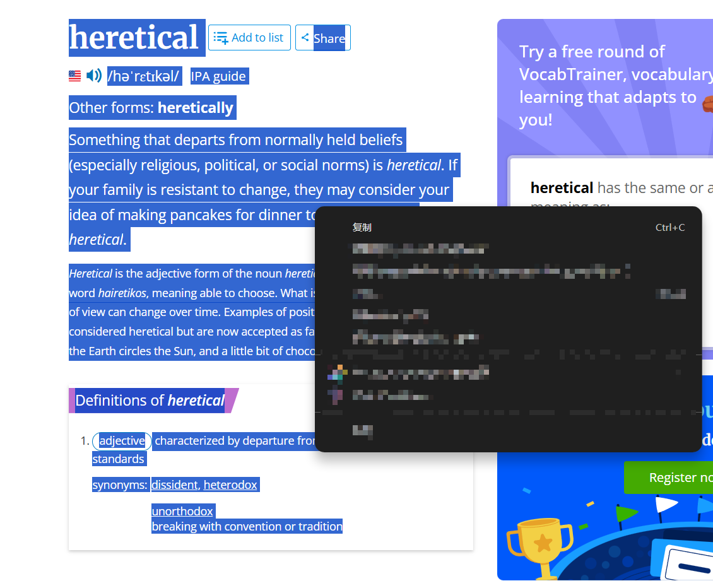
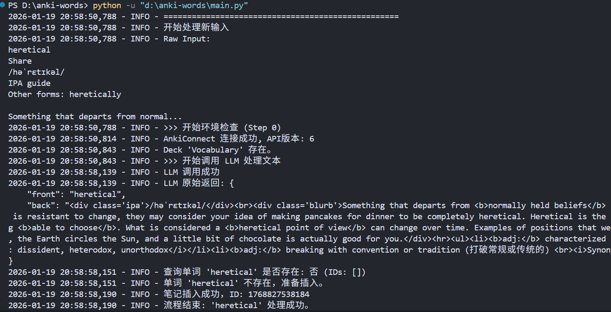
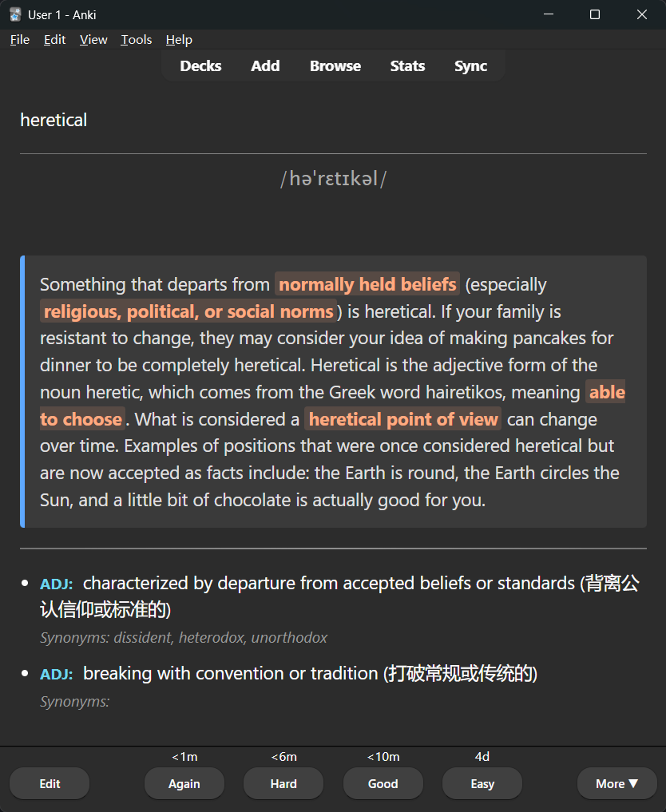
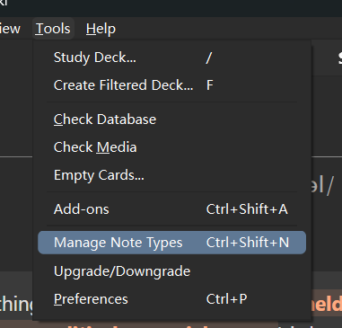
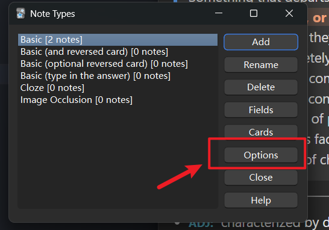
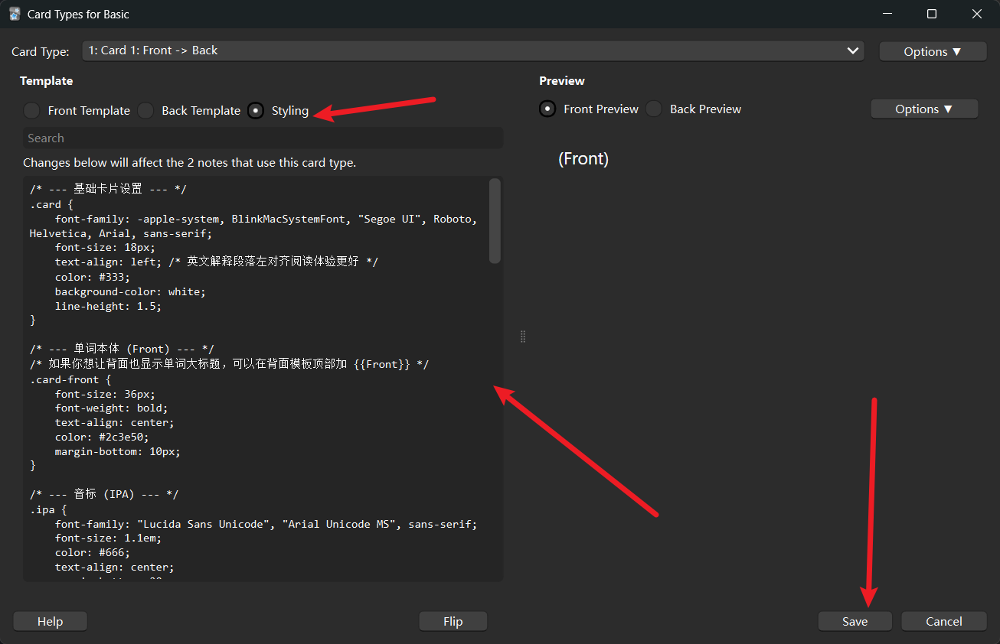

# Quick-Anki
这个项目已经写成Anki插件，没必要继续维护了。请移步 [Quick-Anki 插件](https://github.com/BassShang/quick-anki-addon)

> **Automate your vocabulary acquisition with the power of LLMs.**

这是一个利用大语言模型（LLM）将原生文本整理并自动导入 Anki 的自动化工具。

核心逻辑：**Raw Text -> LLM (提取/清洗) -> Check Anki (查重) -> Import (制卡)**。


## 🧠 动机：帮助我学习单词

> "Language is not a code to be decrypted, but a signal to be processed."

在本项目（以及我的学习路径）中，我坚持一种非传统的单词记忆与语言习得方法。这种方法的核心在于**拒绝“中英互译”，拥抱“英英定义”**。

### 1. 为什么“中英词典”是低效的？

如果我们用机器学习（Machine Learning）的理论来审视语言，中文和英文本质上是两套完全独立的**符号系统**。这意味着：

*   **英文单词** 存在于 `Vector Space A`（向量空间 A）
*   **中文单词** 存在于 `Vector Space B`（向量空间 B）

许多学习者试图通过中英词典建立直接映射（Mapping），即认为 `Word_EN = Word_CN`。但在高维语义空间中，这种映射往往是极其粗糙甚至错误的。

#### 🌰 The "Apple" Paradox
我举个简单的例子，即使是简单的单词，其向量方向也不尽相同：

*   **🇺🇸 Apple:** 关联向量包括 `Fruit`, `Adam & Eve (Sin/Temptation)`, `New York (Big Apple)`, `Technology`, `Pie`.
*   **🇨🇳 苹果:** 关联向量包括 `水果`, `平安夜`, `红富士`, `脆/甜`.

这两个词在物理实体上有重叠（Intersection），但在文化隐喻和语义联想上有着巨大的偏差。如果你只记住了 `Apple = 苹果`，你就丢失了 `Apple` 在英语语境下独有的所有高维特征。

### 2. 最佳实践：在英英词典中建立“印象”

学习单词的最好方式，不是寻找中文对应词，而是**直接在英语的向量空间内建立坐标**。

通过阅读英英词典（如 Vocabulary.com, Oxford, Merriam-Webster）的解释和例句，你是用已知英语单词去界定未知英语单词。这构建了一个封闭且自洽的英语神经网络，而不是依赖中文作为中介层。

**这也是本项目为何着重提取 `Blurb` (语境解释) 和英文 `Definitions` 的原因。**

### 3. "Bug" 还是 "Feature"？

长期坚持这种方法，你可能会遇到一种现象：
> **“我知道这个词是什么感觉，但我一下子想不起来它的中文翻译。”**

很多人认为这是缺陷（Bug），但我认为这是**核心特性（Feature）**。

*   **传统模式（中介转译）：** `Concept` -> `Chinese` -> `English` (高延迟，高损耗)
*   **Native模式（直接映射）：** `Concept` -> `English` (低延迟，无损耗)

当你无法翻译，却能精准使用时，说明你已经像 Native Speaker 一样思考。你的大脑建立了一条直接通往英语概念的神经通路，这正是流利表达的生理基础。

### 4. 👥 谁适合这种方法？ (Target Audience)

这种方法并不适合所有人，它有着明确的筛选门槛：

#### ✅ 适合人群 (Recommended for)
1.  **面向“理解”的学习者**：你的目标是看懂原版文档、无字幕听懂 YouTube 视频、或与国际开发者进行深度技术交流。
2.  **长期主义者**：你不在乎短期内的单词量暴涨，更在乎构建纯正的语感。
3.  **开发者/逻辑思维者**：习惯于理解底层逻辑，而非死记硬背表层符号的人。
4.  **已有一定基础者**：你的词汇量足以支撑你阅读简单的英语释义（通常高中/CET-4以上水平即可启动）。

#### ❌ 不适合人群 (Not recommended for)
1.  **纯应试考生**：如果你下周就要考四六级或考研，需要精准的中文释义来做翻译题，请使用中英词典高效刷题。
2.  **专业翻译人员**：虽然翻译人员也需要英英思维，但他们必须额外训练“双语切换”能力，不能仅停留在“只懂不译”的阶段。
3.  **零基础初学者**：如果连 `Cat` 和 `Dog` 都需要查词，英英词典的递归查询会带来过高的认知负荷。

### 5. 这个项目如何帮助这个过程？

简化创建Anki记忆卡片的流程：

1. 从 Vocabulary.com 或者其它词典中搜索结果
2. 手动复制，贴到程序中
3. 执行程序，自动解析杂乱的内容，创建卡片


## TODO

- [X] 写成一个 Anki 的插件 [已完成，移步这里](https://github.com/BassShang/quick-anki-addon)
- [X] 迭代解析结果
  - [X] 重点内容加粗
  - [X] 辅助中文释义
  - [X] 确保输出结果一定包含美式音标
- [ ] 添加卡片后自动增加发音


## 效果




注意，为了让添加完的卡片这么美观，需要在Anki中 [添加css](#添加css)


## ✨ 功能特性

*   **智能清洗**：利用 LLM (Doubao/Volcengine) 从 Vocabulary.com 等来源的杂乱文本中提取单词、IPA 音标、语境解释（Blurb）和释义。
*   **第0步检查**：脚本启动时自动检查 AnkiConnect 接口连通性以及目标 Deck 是否存在（不存在则自动创建）。
*   **智能查重**：在插入卡片前，自动查询当前 Deck 中是否已包含该单词，避免重复制卡。
*   **日志系统**：按日期（`YYYY_mm_dd.log`）生成独立日志，详细记录输入、LLM 响应、查重结果及报错信息。


## 🛠️ 前置要求

1.  **Anki Desktop**: 请确保已安装 Anki 桌面版并保持后台运行。
2.  **AnkiConnect**: 必须安装 Anki 插件 [AnkiConnect](https://ankiweb.net/shared/info/2055492159) (代码: `2055492159`)。
    *   *注意：安装后需重启 Anki。*
3.  **Python 3.8+**
4.  **API Key**: 拥有火山引擎（Doubao）或其他兼容 OpenAI SDK 的 API Key。


## 📦 安装指南

1.  **克隆或下载本项目**

2.  **安装依赖**
    ```bash
    pip install -r requirements.txt
    ```
    *`requirements.txt` 内容应包含：`openai`, `python-dotenv`, `requests`*

3.  **配置文件**
    在项目根目录下创建一个 `.env` 文件，并填入以下内容：

    ```ini
    # --- LLM 配置 (火山引擎示例) ---
    ARK_API_KEY=sk-xxxxxxxxxxxxxxxxxxxxxxxx      # 您的 API Key
    ARK_BASE_URL=https://ark.cn-beijing.volces.com/api/v3
    ARK_MODEL_ID=doubao-1-5-pro-32k-250115       # 您的推理接入点 ID
    
    # --- Anki 配置 ---
    ANKI_CONNECT_URL=http://127.0.0.1:8765       # AnkiConnect 默认地址
    ANKI_DECK_NAME=Vocabulary                    # 目标牌组名称
    ANKI_MODEL_NAME=Basic                        # 笔记类型 (Basic/Front and Back)
    
    # --- 日志配置 ---
    LOG_ENABLED=True
    LOG_DIR=./logs
    ```

## 🚀 使用方法

### 1. 直接运行 (测试)

您可以直接运行 `main.py` 来测试功能。请先修改 `main.py` 底部 `if __name__ == "__main__":` 中的 `sample_text` 为您想测试的文本。

```bash
python main.py
```

### 2. 作为模块调用 (集成)

在您的其他 Python 脚本中引入并调用核心函数：

```python
from main import process_vocabulary

raw_text = """
ephemeral
/əˈfem(ə)rəl/
Something that is fleeting or short-lived is ephemeral...
"""

# 这将自动执行：检查环境 -> 调用LLM -> 查重 -> 插入Anki
process_vocabulary(raw_text)
```

## 📂 项目结构

```text
.
├── main.py              # 核心逻辑脚本
├── .env                 # 配置文件 (需手动创建)
├── requirements.txt     # Python 依赖库
├── README.md            # 项目说明
└── logs/                # 日志目录 (自动生成)
    ├── 2023_10_27.log
    └── ...
```

## 📝 日志说明

每次运行都会在 `logs/` 目录下生成或追加当天的日志文件。日志包含以下关键信息：

*   **INFO**: 接口连接状态、Deck 状态、单词查重结果（存在/不存在）、插入结果。
*   **ERROR**: 网络错误、API 调用失败、JSON 解析错误等。

**日志示例：**
```text
2023-10-27 10:00:01 - INFO - >>> 开始环境检查 (Step 0)
2023-10-27 10:00:01 - INFO - AnkiConnect 连接成功, API版本: 6
2023-10-27 10:00:01 - INFO - Deck 'Vocabulary' 存在。
2023-10-27 10:00:02 - INFO - LLM 调用成功
2023-10-27 10:00:02 - INFO - 查询单词 'spurious' 是否存在: 是
2023-10-27 10:00:02 - INFO - 单词 'spurious' 已存在于 Deck 'Vocabulary' 中。跳过插入。
```

## 添加css

为了让卡片背面与效果图一样好看，添加以下css
```css
/* --- 基础卡片设置 --- */
.card {
    font-family: -apple-system, BlinkMacSystemFont, "Segoe UI", Roboto, Helvetica, Arial, sans-serif;
    font-size: 18px;
    text-align: left; /* 英文解释段落左对齐阅读体验更好 */
    color: #333;
    background-color: white;
    line-height: 1.5;
}

/* --- 单词本体 (Front) --- */
/* 如果你想让背面也显示单词大标题，可以在背面模板顶部加 {{Front}} */
.card-front {
    font-size: 36px;
    font-weight: bold;
    text-align: center;
    color: #2c3e50;
    margin-bottom: 10px;
}

/* --- 音标 (IPA) --- */
.ipa {
    font-family: "Lucida Sans Unicode", "Arial Unicode MS", sans-serif;
    font-size: 1.1em;
    color: #666;
    text-align: center;
    margin-bottom: 20px;
    margin-top: -10px;
}

/* --- 语境解释 (Blurb) --- */
/* 这是重点区域，做成了引用块的样式 */
.blurb {
    background-color: #f4f6f8; /* 浅灰背景 */
    border-left: 5px solid #3498db; /* 左侧蓝色竖条 */
    padding: 15px;
    margin: 15px 0;
    border-radius: 4px;
    color: #444;
}

/* --- Blurb 中的高亮重点 (关键需求 1) --- */
/* LLM 输出的 <b>complicated</b> 会应用此样式 */
.blurb b {
    color: #d35400; /* 醒目的深橘色/赭石色 */
    background-color: rgba(211, 84, 0, 0.1); /* 淡淡的背景色增加强调感 */
    padding: 0 4px;
    border-radius: 3px;
    font-weight: 700;
}

/* --- 分割线 --- */
hr {
    border: 0;
    height: 1px;
    background-image: linear-gradient(to right, rgba(0, 0, 0, 0), rgba(0, 0, 0, 0.2), rgba(0, 0, 0, 0));
    margin: 20px 0;
}

/* --- 释义列表 --- */
ul {
    padding-left: 20px;
    margin: 0;
}

li {
    margin-bottom: 12px;
}

/* --- 词性 (adj/noun) --- */
li b {
    color: #2980b9; /* 蓝色 */
    font-weight: bold;
    text-transform: uppercase;
    font-size: 0.85em;
    margin-right: 5px;
}

/* --- 同义词 (Synonyms) --- */
li i {
    display: block; /* 换行显示 */
    font-size: 0.85em;
    color: #7f8c8d; /* 灰色 */
    margin-top: 2px;
}

/* ========================================
   🌙 夜间模式适配 (Dark Mode)
   Anki 会自动检测系统夜间模式
   ======================================== */
.nightMode .card {
    background-color: #2f2f31;
    color: #dcdcdc;
}

.nightMode .card-front {
    color: #ffffff;
}

.nightMode .ipa {
    color: #aaaaaa;
}

.nightMode .blurb {
    background-color: #3a3a3a;
    border-left-color: #5ea8ff;
    color: #e0e0e0;
}

/* 夜间模式下的高亮颜色调整 */
.nightMode .blurb b {
    color: #ffaa80; /* 浅橙色，在黑底上更清晰 */
    background-color: rgba(255, 170, 128, 0.15);
}

.nightMode hr {
    background-image: linear-gradient(to right, rgba(255, 255, 255, 0), rgba(255, 255, 255, 0.2), rgba(255, 255, 255, 0));
}

.nightMode li b {
    color: #6dd5ed; /* 浅蓝 */
}

.nightMode li i {
    color: #999;
}
```






## ⚠️ 常见问题
0.  **莫名其妙找不到deck**
    * 务必确保Anki安装时选的语言是英文 *

1.  **ConnectionRefusedError / 无法连接 AnkiConnect**
    *   检查 Anki 是否已打开。
    *   检查 AnkiConnect 配置（`工具` -> `附加组件` -> `AnkiConnect` -> `配置`）中 `webBindAddress` 是否为 `127.0.0.1`。

2.  **LLM 返回格式错误**
    *   脚本内置了 JSON 提取器，可以处理 LLM 偶尔包裹 markdown 代码块的情况。如果依然报错，请检查 `logs` 中的 `LLM 原始返回`，可能需要微调 Prompt。